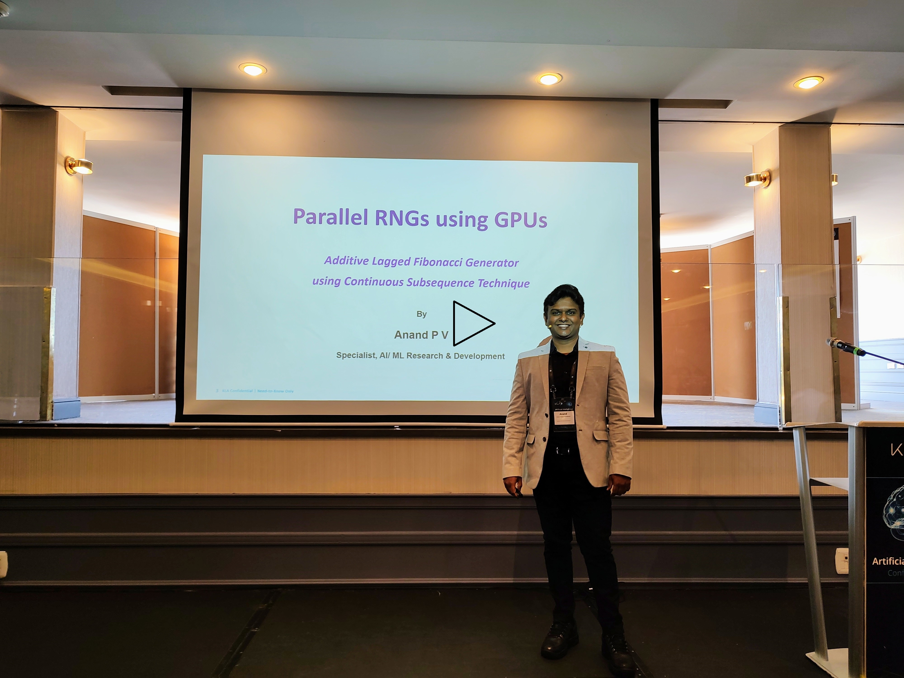

# Parallel-RNG-using-GPU
Parallel implementation of inherently sequential algorithms. NVidia CUDA implementation of Additive Lagged Fibonacci Generator using Continuous Subsequence Technique and GFSR using Leap Frog Technique. Paper presented in KLA AI Conference 2022, Tel Aviv, Israel. 

Notable Source Codes:
- ALFG_Multi.cu
- ALFG_Single.cu
- GFSR.cu

Watch highlights of the Presentation:

